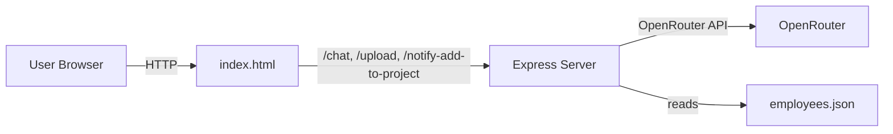

# Architecture Overview

## System Context
- **Frontend**: Single-page UI in `index.html` (vanilla JS) for messaging, uploads, and displaying AI replies.
- **Backend**: Node.js/Express server (`server.js`) exposing REST endpoints and forwarding chat to OpenRouter.
- **External Services**:
  - OpenRouter Chat Completions API (model configurable via `OPENROUTER_MODEL`).
  - SMTP provider via Nodemailer (optional, for notify add-to-project feature).

## High-Level Diagram (Mermaid)

## Components
- **Frontend (index.html)**
  - Upload zone (`.txt` only; validated server-side via Multer).
  - Message input and Send button.
  - Renders model reply; detects Markdown tables and adds actions:
    - Download table
    - Add Employees to Project (opens modal; calls `/notify-add-to-project`).

- **Backend (server.js)**
  - `GET /health`: health probe.
  - `POST /upload`: echoes metadata of uploaded `.txt` files (memory only).
  - `POST /chat`: composes user message + optional `employees.json` + uploaded docs; calls OpenRouter; returns reply.
  - `POST /notify-add-to-project`: emails selected EIDs for a project (via SMTP).

## Data Flow
1. User enters message and optionally uploads `.txt` files.
2. Frontend posts to `/chat` with `FormData` (message, includeEmployees flag, files).
3. Server builds OpenAI-compatible messages (text parts and image URLs), reads `employees.json` if requested, applies size caps and truncation.
4. Server calls OpenRouter, returns reply text to frontend.
5. Frontend renders reply; if table with EIDs detected, enables actions (download, notify/add).
6. Notify action posts to `/notify-add-to-project`, server sends emails via SMTP.

## Configuration
- `.env` keys:
  - `PORT` (default 3000)
  - `OPENROUTER_API_KEY` (required)
  - `OPENROUTER_MODEL` (default `qwen/qwen3-coder:free`)
  - `SYSTEM_PROMPT` (optional)
  - `SMTP_HOST`, `SMTP_PORT`, `SMTP_SECURE`, `SMTP_USER`, `SMTP_PASS`, `SMTP_FROM` (optional for email)

## Security Notes
- Multer filters to `.txt` but backend also guards by MIME and size caps.
- No persistent storage of uploads (memory-only).
- Do not commit real API keys or credentials.
