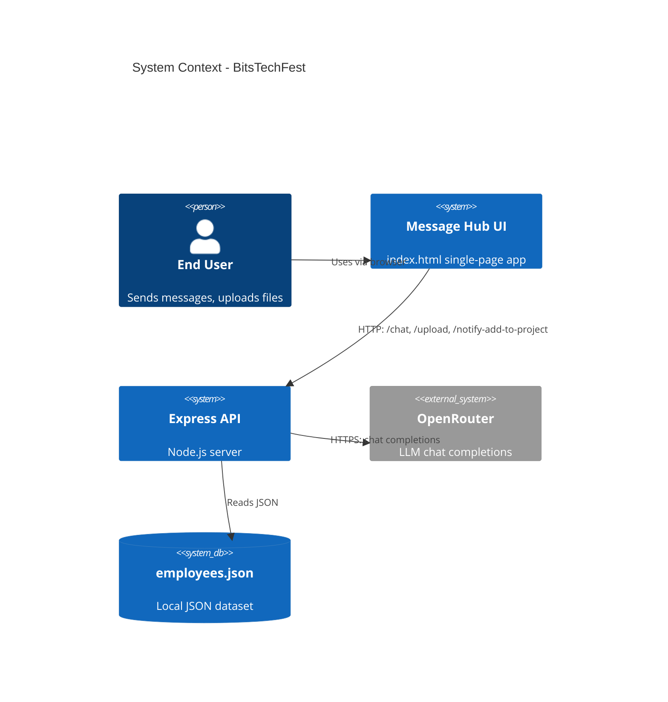
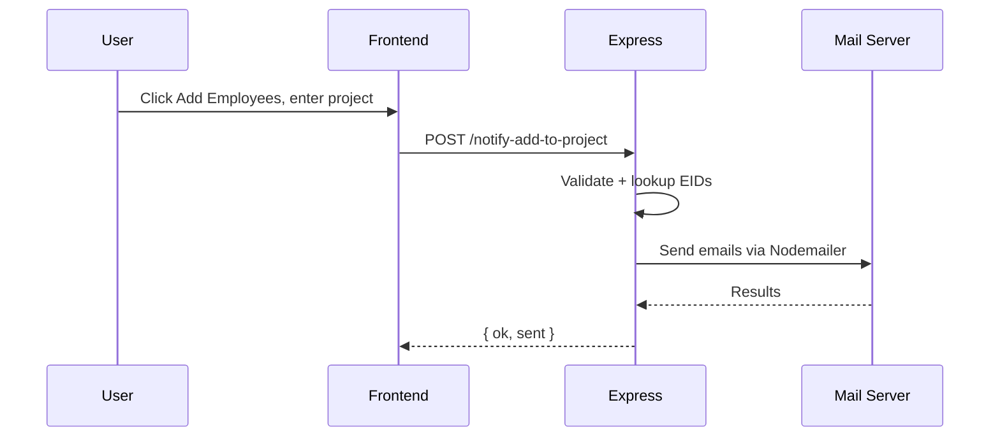
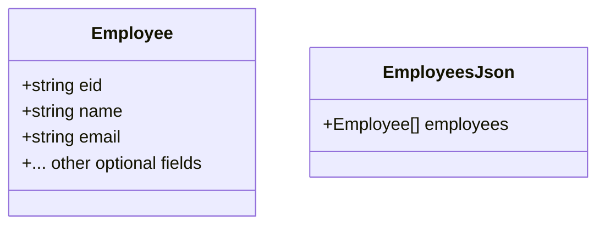

# Diagrams

This document centralizes system, component, sequence, and data diagrams. Render with Mermaid-compatible viewers (e.g., GitHub, VS Code).

## System Context


## Component Diagram (Backend)
```mermaid
flowchart LR
  subgraph Express Server
    Router[Express Router]
    Multer[Multer .txt Filter]
    Chat[Chat Controller]
    Notify[Notify Controller]
    OpenRouterClient[OpenRouter Client (undici)]
    Mailer[Nodemailer Transport]
  end
  Employees[(employees.json)]
  OpenRouter[(OpenRouter API)]

  Router --> Multer
  Multer --> Chat
  Chat --> OpenRouterClient
  Chat --> Employees
  Router --> Notify
  Notify --> Employees
  Notify --> Mailer
  OpenRouterClient --> OpenRouter
```

## Sequence: /chat End-to-End
```mermaid
sequenceDiagram
  participant U as User
  participant FE as Frontend
  participant BE as Express
  participant OR as OpenRouter

  U->>FE: Enter message + choose files
  FE->>BE: POST /chat (FormData)
  BE->>BE: Build content parts + diagnostics
  BE->>OR: Chat Completions
  OR-->>BE: JSON { choices }
  BE-->>FE: { ok, reply, files, diagnostics }
  FE->>U: Render reply; actions if table
```

## Sequence: Notify Add to Project


## Data Model (High Level)

