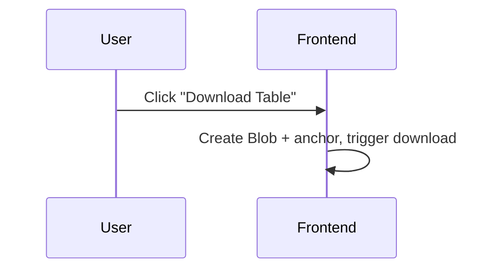
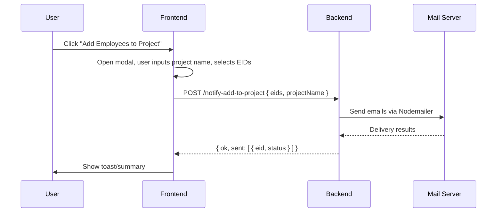

  # Flows and Sequences

## User Journey: Send Message with Files
```mermaid
sequenceDiagram
  participant U as User
  participant FE as Frontend (index.html)
  participant BE as Backend (Express)
  participant OR as OpenRouter

  U->>FE: Type message, choose .txt files, click Send
  FE->>BE: POST /chat (FormData: message, includeEmployees, files)
  BE->>BE: Build content parts, read employees.json (optional)
  BE->>OR: Chat Completions
  OR-->>BE: Reply JSON
  BE-->>FE: { ok, reply, files, diagnostics }
  FE->>FE: Render reply; detect Markdown table
  FE->>U: Show actions: Download, Add Employees to Project
```

## Flow: Download Table


## Flow: Add Employees to Project


## Error Handling
- **Validation**: Frontend requires message or files; backend validates `.txt` only.
- **Network/Model errors**: Displayed in UI via catch block; server returns structured error.
- **Large inputs**: Backend truncates or reduces employees payload, returns `diagnostics`.
