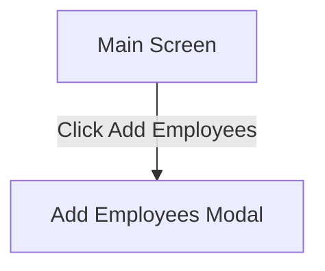

# Wireframes (Text + Mermaid)

These wireframes document the primary screens. Replace with real images as needed.

## Main Screen
```
+--------------------------------------------------------------+
| Message Hub                                                  |
+---------------------------+----------------------------------+
| Attachments               | Reply Panel                      |
| [ Drag .txt here ]        | [Reply content renders here]     |
| [ Choose Files ]          |                                  |
|                           |  [Download Table] [Add Employees]|
+---------------------------+----------------------------------+
| [ ] Include employees.json                                  |
| [ Type your message...                      ] [ Send ]       |
+--------------------------------------------------------------+
```

## Modal: Add Employees to Project
```
+-----------------------------------------------+
| Suggested Employees            [Close]         |
+-----------------------------------------------+
| Project: [ Project name ] [Preview Email]     |
|                                               |
| +-------------------------------------------+ |
| | EID   | Name            | Email           | |
| |-------------------------------------------| |
| | E123  | Jane Doe        | j@ex.com        | |
| | E456  | John Smith      | s@ex.com        | |
| +-------------------------------------------+ |
| [ Select All ] [ Add Employees to Project ]   |
+-----------------------------------------------+
```

## Screen Map (Mermaid)


## Notes
- Reply panel renders Markdown; table detection powers actions.
- Modal is dynamically created in JS; no separate HTML file.

---

## Component Legend (Desktop)
- Header: Title area.
- Left Panel: Upload zone (drag/drop and choose files).
- Right Panel: Reply area (renders Markdown; shows actions when a table with EIDs is detected).
- Footer: Include employees toggle; message input; Send button.

## Desktop Layout (Annotated)
```
+-----------------------------------------------------------------------------------+
| Message Hub                                                                       |
+-----------------------------+-----------------------------------------------------+
| Attachments                 | Reply Panel                                         |
|                             |                                                     |
|  [ Drag .txt here ]         |  Reply                                             |
|  [ Choose Files ]           |  ------------------------------------------------  |
|  • Accepts .txt only        |  • Displays formatted Markdown                     |
|  • Shows selected files     |  • If table with EID present:                      |
|                             |      [Download Table] [Add Employees to Project]   |
+-----------------------------+-----------------------------------------------------+
| [ ] Include employees.json                                                     | i |
| [ Type your message...                                      ]   [ Send ]        |n|
+-----------------------------------------------------------------------------------+
```

## Mobile Layout (Stacked)
```
+------------------------------------+
| Message Hub                        |
+------------------------------------+
| Attachments                        |
| [ Drag .txt here ]                 |
| [ Choose Files ]                   |
| [ ] Include employees.json         |
+------------------------------------+
| Reply Panel                        |
| [Reply content renders here]       |
| [Download Table] [Add Employees]   |
+------------------------------------+
| [ Type your message... ] [Send]    |
+------------------------------------+
```

## States
- Loading: Send disabled, button shows “Sending…”.
- Success: Reply panel updated; actions appear if table detected.
- Error: Error banner appended to replies area with message text.
- Empty: Prompt suggests typing a message or attaching files.

## Interactions
- Dragging files over upload zone highlights the drop area.
- Send validates: requires message or at least one file.
- Download Table creates a text file of the Markdown table and triggers download.
- Add Employees opens modal with project input, preview, and selection table.

## Accessibility
- All interactive elements are buttons or inputs with clear labels.
- Keyboard: Tab order flows from upload → message → send → actions.
- Contrast: Buttons and text use sufficient contrast for readability.
